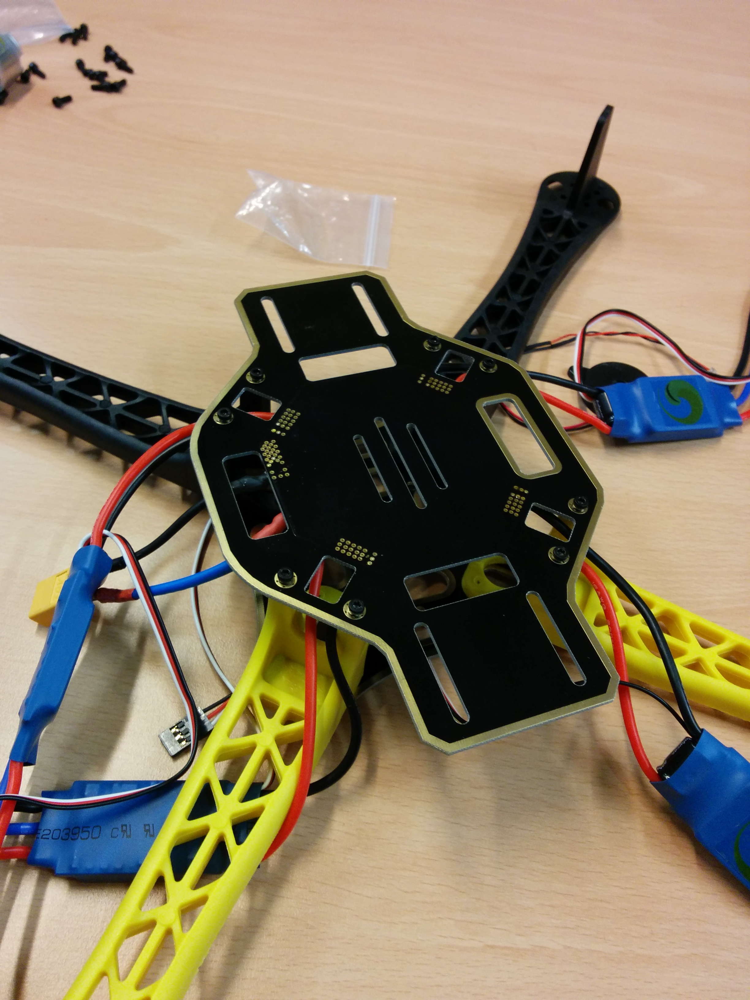
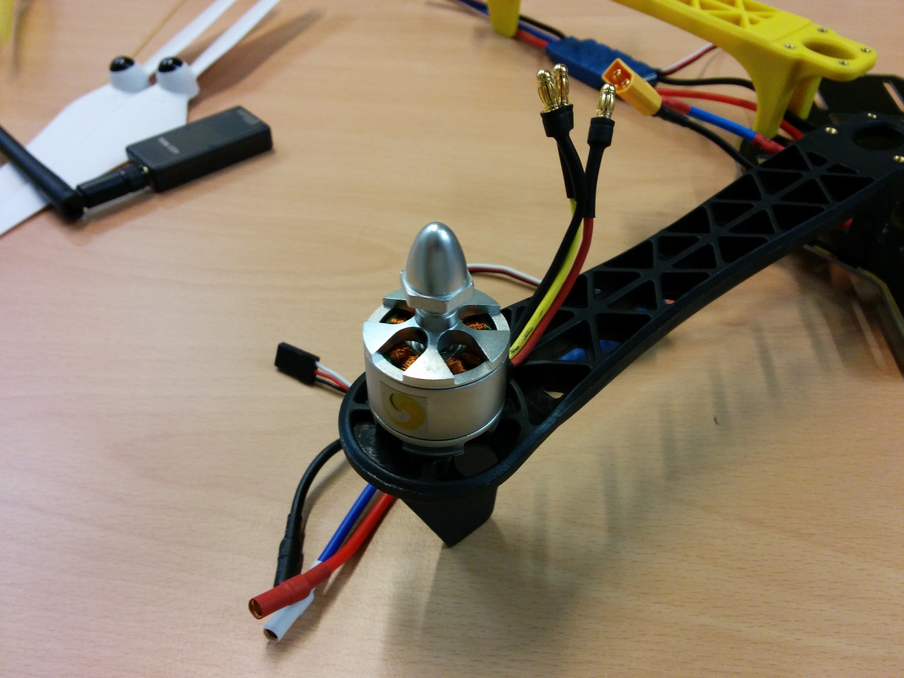
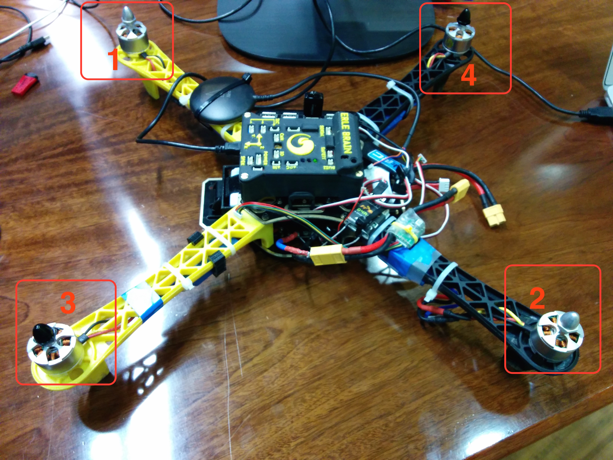
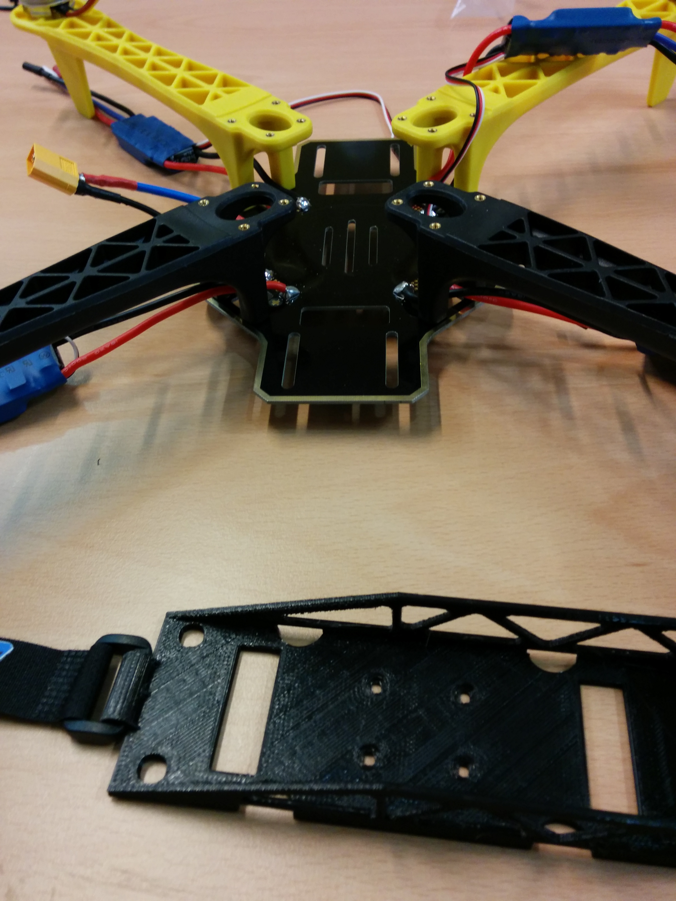
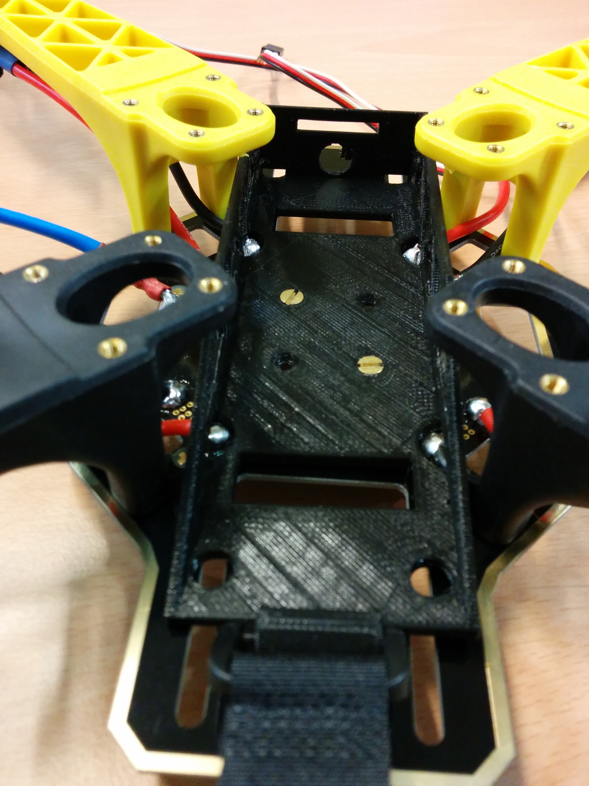
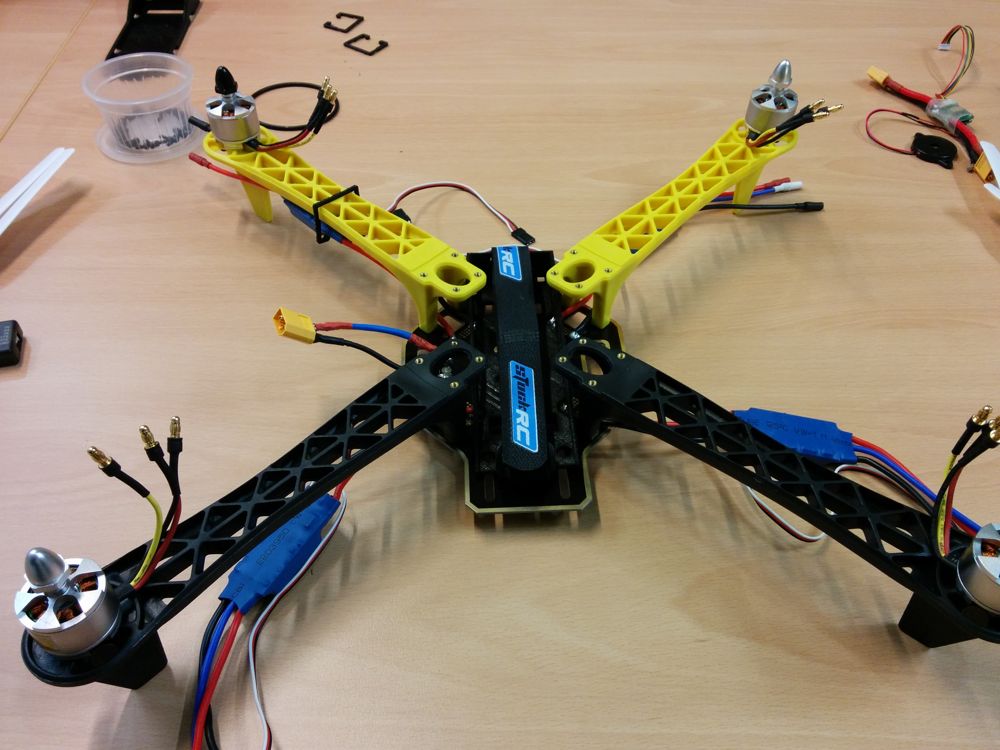
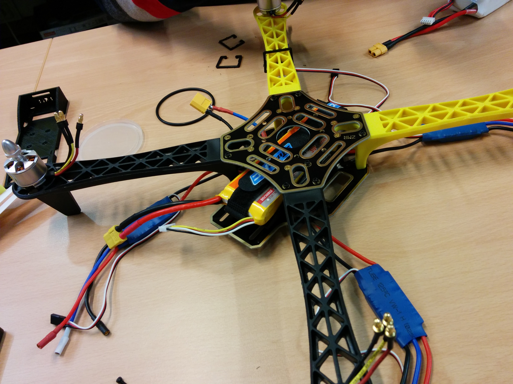
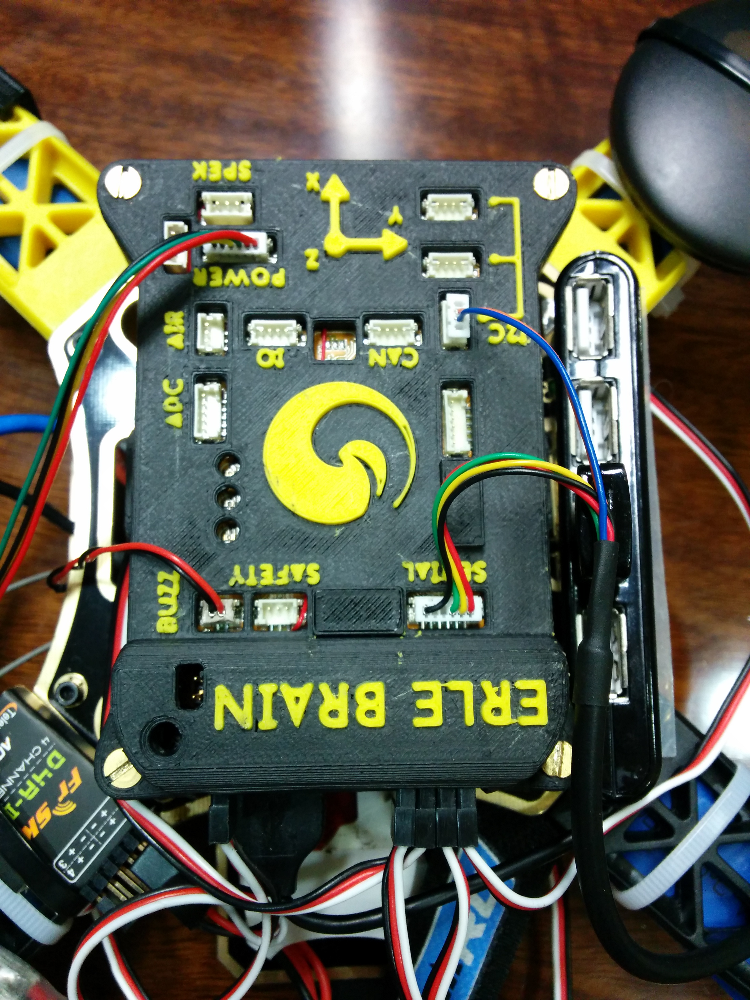

# Assembly of Erle-copter

The following content will explain how to fully assembly Erle-copter.

**Erle-copter is shipped mounted. The following guide provides a step-by-step walkthrough on how to build your own copter using Erle-brain**

## Index
- [Material needed](#material-needed)
- [Soldering the speed controllers](#soldering-the-speed-controllers)
- [Mounting the copter core](#mounting-the-copter-core)
- [Mounting the motors](#mounting-the-motors)
- [Battery holder assembly](#battery-holder-assembly)
- [Mounting the upper frame](#mounting-the-upper-frame)
- [Mounting the autopilot](#mounting-the-autopilot)
- [Holding the ESCs](#holding-the-escs)
- [Connecting everything to the autopilot](#connecting-everything-to-the-autopilot)

### Material needed

In order to make a minimum flying vehicle you'll need at least:
- Frame
- Motors
- Speed controllers
- Propellers
- [Erle-brain](http://erlerobotics.com/blog/tienda/erle-brain)
- Power module
- Battery
- Radio Control method (either traditional 2.4 GHz radio frequency controller or alternatives such as rc-override using WiFi, Bluetooth, etc.)

**For safety precautions, at Erle Robotics, we recommend the use of a dedicated RC transmitter (+ controller) and receiver**.

Besides the minimum set of requirements to get a flyable vehicle, the different flight modes might require extra sensors/actuators. Here're some of them:
- Telemetry (either a dedicated RF link or through WiFi)
- GPS
- external sensors such as compass, barometers, etc.
- additional legs
- ...

All these components are available through the [Erle Robotics store](http://erlerobotics.com/blog/store), either through kits or individually.

### Soldering the speed controllers

The Electronic Speed Controllers (ESCs) allow the hardware autopilot (Erle-brain in this scenario) to interface with the motors appropriately taking care of converting the PWM logic that the autopilot transmits into rotation speeds on the motors. The ESCs are directly soldered into the base of Erle-copter which avoids using additional cables.

Besides soldering the ESCs we also add a XT-60 male connector that will be used for the Power Module.

### Mounting the copter core

-----

**NOTE: We'd recommend you to use yellow legs for the front and black legs for the back of the copter. This will help you identify the position of your copter while flying.**

-----

Once the ESCs and the XT-60 connector have been soldered, you should screw the legs to the base board

Additionally, you could add separators between the legs and the bottom frame to increase the available space (e.g.: add thicker batteries, place components inside, etc)

### Mounting the motors

Mount the motors at the end of the copter legs use 4 screws for each motor to fix them.

-----

**NOTE: Depending on what kind of motor/propellers you use, there might be clockwise and counterclockwise motors. Refer to the following picture for the motor ordering number:**

-----

### Battery holder assembly

The battery holder allows to easily attach and detach the battery inside of the copter. We use two simple screws to fix it.

### Mounting the upper frame

Next step is to mount the upper board and screw it.

### Mounting the autopilot

We will now mount Erle-brain in the copter. The autopilot comes with tiny flaps that allow to attach it pretty much anywhere with an elastic band:

### Holding the ESCs

We generally hold the ESCs using flanges but feel free to do it your own way:

### Connecting everything to the autopilot

It's now time to start connecting all the peripherals to Erle-brain. Start with motor 1 connecting the signal (white cable) in the upper part:

Following motor 1, connect 2, 3 and 4. Next, you should attach the RC receiver that should be placed in the last row (number 14). If you plan to use a USB hub as we do now is the time ;).

After you've populated the motors and RC input we start hooking the DF-13 connectors with their corresponding devices. The power module and the buzzer are easy to identify. Depending on which GPS you've selected you'll have either one or two DF-13 connectors (the second will correspond with the external compass). The GPS should go into the `SERIAL` port and the compass (DF-13 4 pins) should go in one of the I2C ports.

Lastly we connect devices to the USB hub. Generally we connect WiFi USB dongles, Bluetooth dongles or the telemetry devices.

**The hardware is now ready to fly :) but before you do so, make sure you check the software aspects.**