# Montaje de Erle-copter

El siguiente contenido explica cómo montar completamente Erle-Copter.

**Erle-Copter se entrega montado. La siguiente guía proporciona una guía paso a paso sobre cómo construir tu propio quadricóptero usando Erle-Brain**.

## Indice
- [Material necesario](#material-necesario)
- [Soldando los ESC](#soldando-los-esc)
- [Montando el core del quadricoptero](#montando-el-core-del-quadricoptero)
- [Montando los motores](#montando-los-motores)
- [Soporte para la batería](#soporte-para-la-bateria)
- [Montando la parte superior del chasis](#montando-la-parte-superior-del-chasis)
- [Montando el autopiloto](#mounting-the-autopilot)
- [Sujetando los ESCs](#holding-the-escs)
- [Conectando todo al autopiloto](#connecting-everything-to-the-autopilot)

------

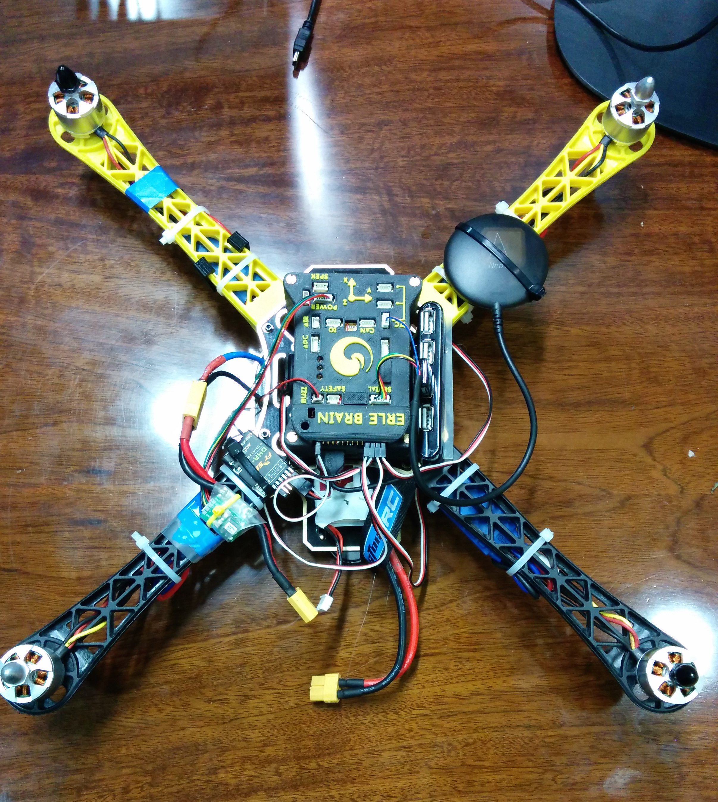

### Material necesario

Con el fin de construir un vehículo volador básico se necesita al menos:
- Chasis
- Motores
- Controladores de velocidad
- Hélices
- [Erle-brain](http://erlerobotics.com/blog/tienda/erle-brain)
- Power module
- Batería
- Sistema de radio control (tradicionalmente un controlador de radio frecuencia a 2.4GHz o alternativamente sobreescribiendo los valores de RC con WiFi, Bluetooth, etc).

**Por seguridad, en Erle Robotics, recomendamos el uso de un transmisor (+ controlador) y un receptor de radio frecuencia a 2,4GHz o 5GHz**.

Además del conjunto mínimo de requisitos para ser capaz de volar, los diferentes modos de vuelo pueden requerir sensores y actuadores extras. Algunos de ellos a continuación:
- Telemetría (ya sea un enlace de radio frecuencia o a través de WiFi)
- GPS
- Sensores externos como una brújula, barómetro, etc.
- Patas adicionales
- ...

Todos éstos componentes están disponibles a través de la [tienda de Erle Robotics](http://erlerobotics.com/blog/store), ya sea en kits o individualmente.

### Soldando los ESC
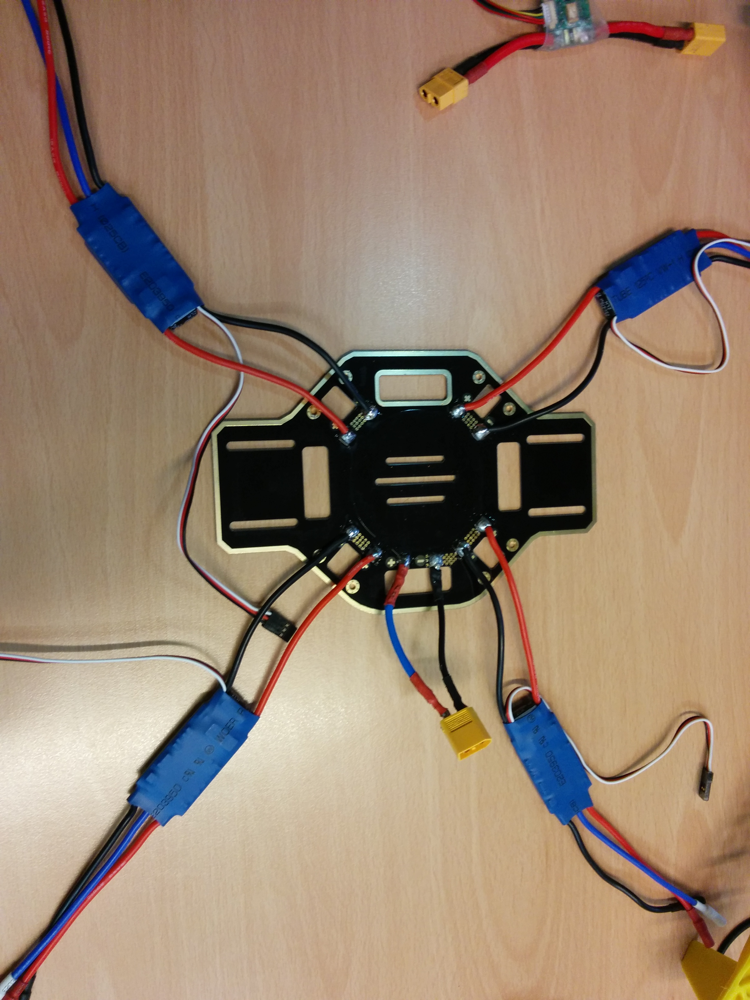

Los controladores eléctricos de velocidad (ESC) permiten al hardware del autopiloto (Erle-Brain en este caso) interactuar con los motores apropiadamente para convertir la señal de PWM que el autopiloto transmite en una velocidad de rotación de los motores. Los ESCs están directamente conectados a las base de Erle-Copter, que evita el uso de cables adicionales.

Además de las soldatura los ESCs también tiene un conector macho XT-60 que permite utilizar el Power Module.

### Montando el core del quadricoptero

-----

**NOTA: Recomendamos que use los brazos amarillos en la parte delantera y los brazos negros en la parte trasera del quadricoptero. Esto le ayudará a identificar la posición del vehículo cuando esté volando.**
-----

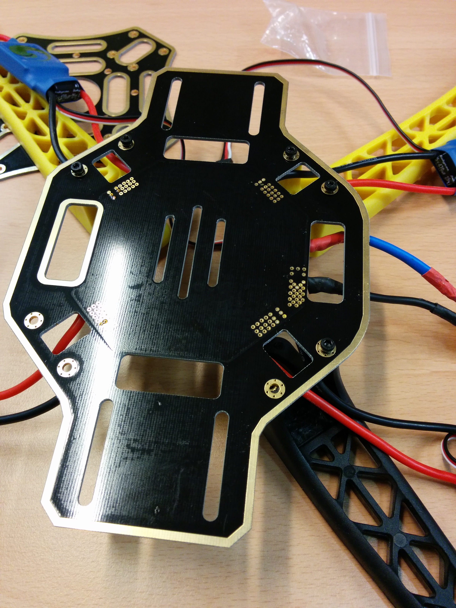

Una vez que los ESCs y el conector XT-60 estén soldados, deberás atornillar los brazos a la base de la placa.

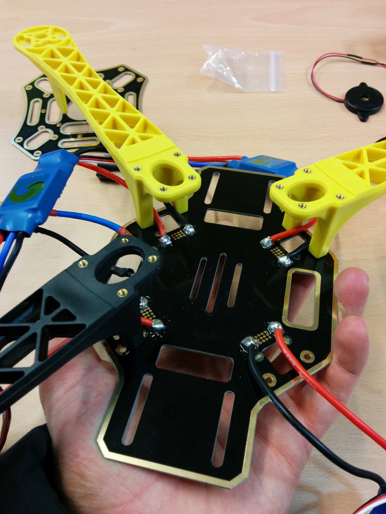

Adicionalmente puedes añadir separadores entre los brazos y la parte inferior del chasis para incrementar el espacio disponible (por ejemplo: para añadir una bateria más grande, poner componentes dentro, etc).

### Montando los motores

Monta los motores al final de los brazos del vehículo, usa 4 tornillos en cada motor para sujetarlos.

-----

**NOTA: Dependiendo de que tipo de motor/hélice utilice, puede usar motores que giren en sentido horario o antihorario. Tenga en cuenta la siguiente imagen para el orden de los motores.**

-----

### Soporte para la batería

El soporte de la batería permite conectar y desconectar facilmente la batería en el vehículo. Se utilizan dos simples tornillos para sujetarlo.

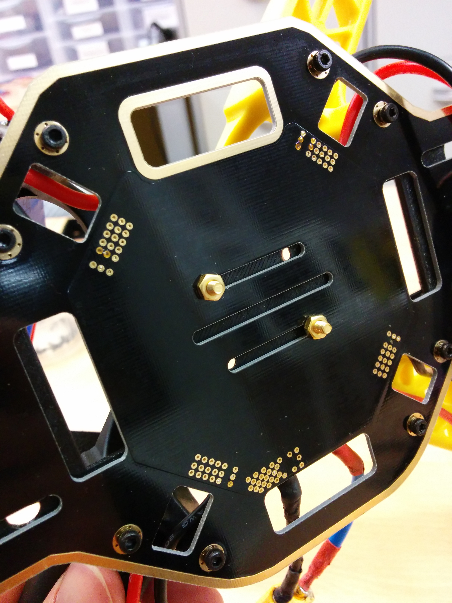

### Montando la parte superior del chasis

El siguiente paso es montar la parte superior y atornillarla.

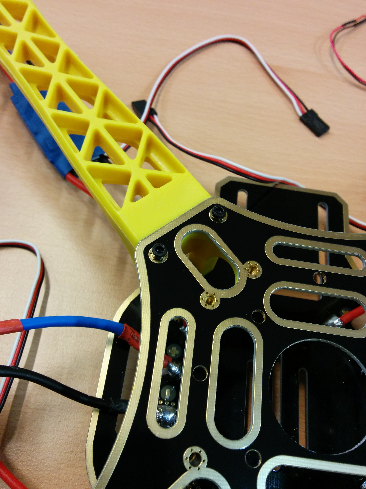

### Montando el autopiloto

Ahora montamos Erle-Brain al quadricoptero. El autopiloto viene con unas orejeras que permiten sujetarlo con una junta tórica.

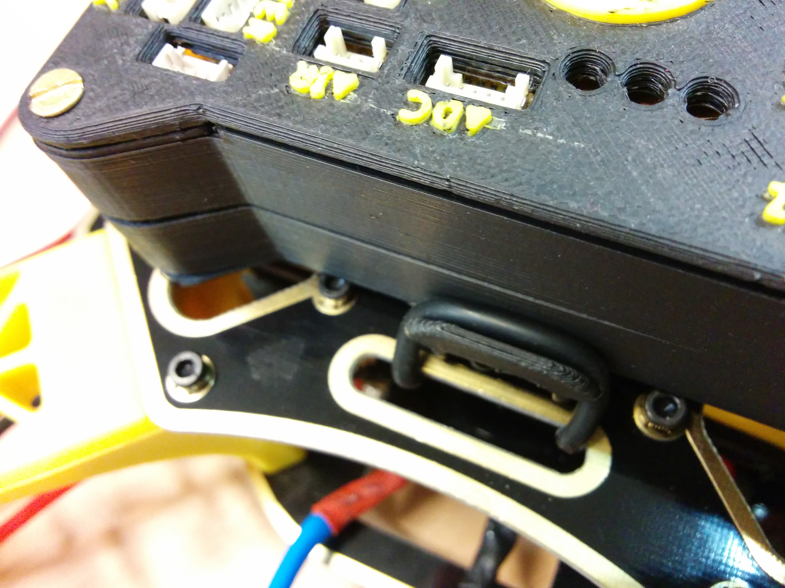
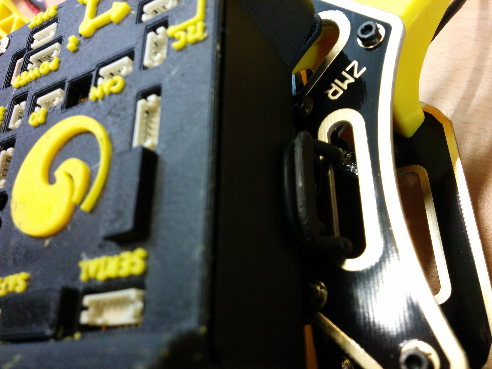
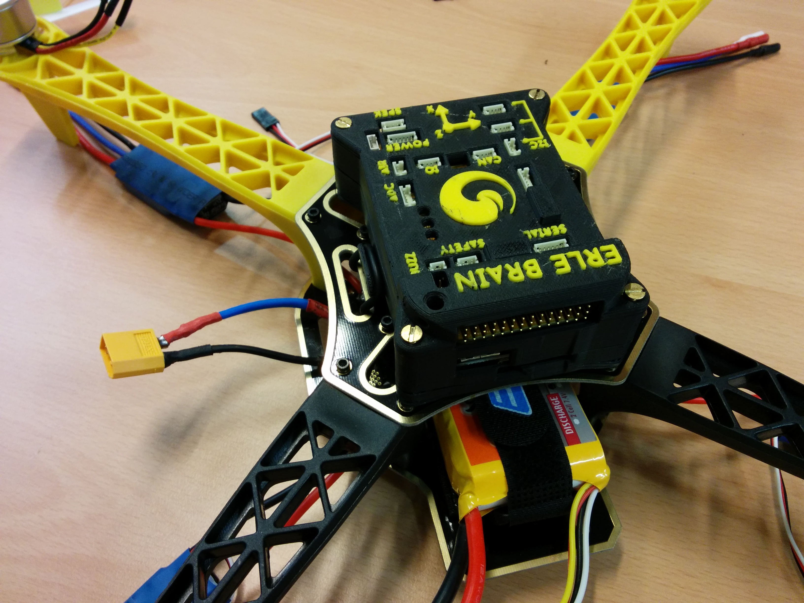

### Sujetando los ESCs

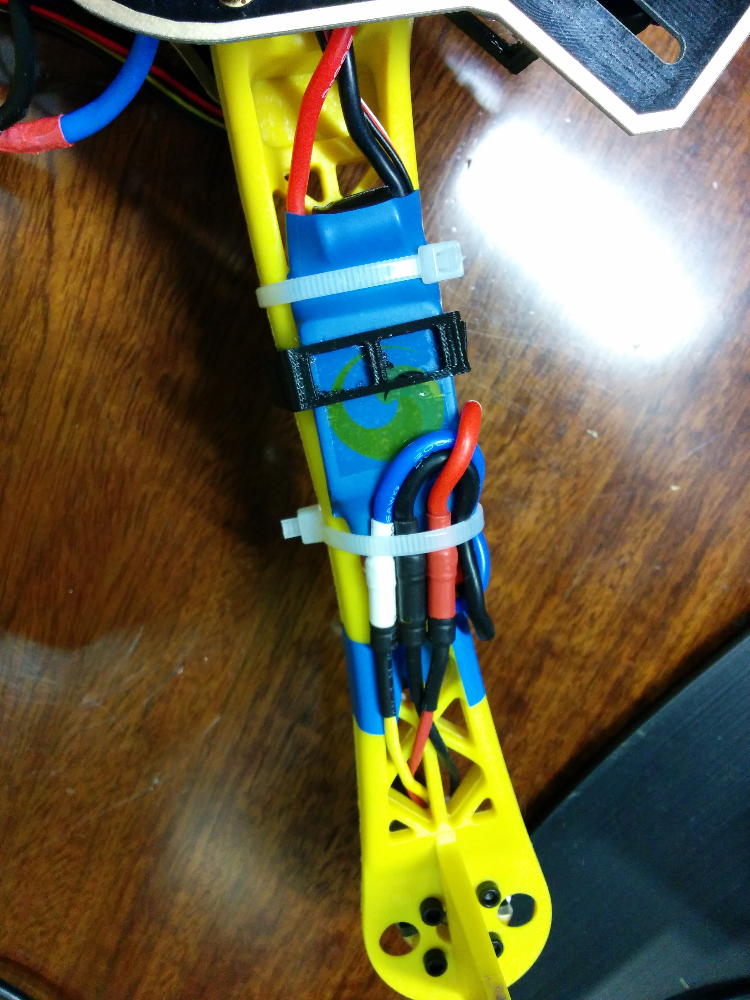

Generalmente sujetamos los ESC usando bridas, pero siéntete libre de sujetarlos a tu manera:

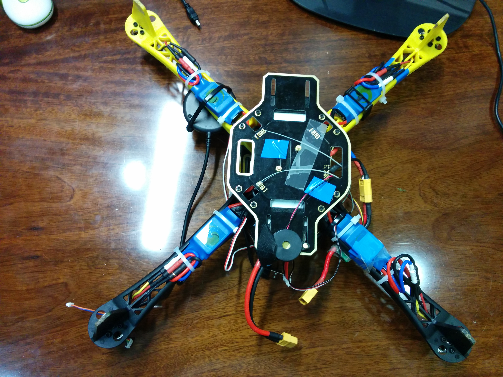

### Conectando todo al autopiloto

Es la hora de comenzar a conectar todos los periféricos a Erle-Brain. Empieza conectado el motor 1, la señal (el cable blanco) va en la parte superior: 

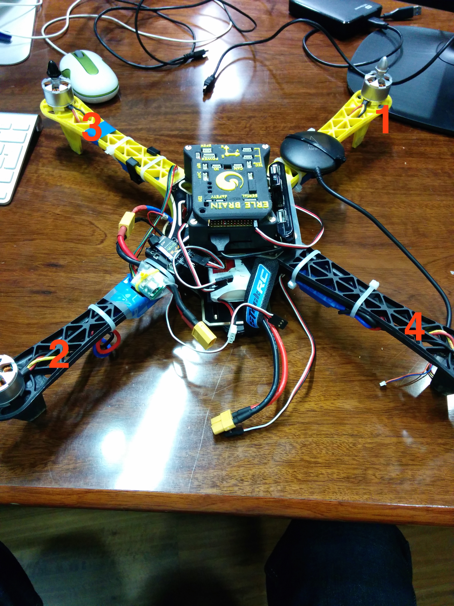

De la misma forma que el motor 1, conecta el motor 2, 3 y 4. A continuación, debes conectar el receptor de radio frecuencia que debe conectarse en la última fila (número 14). Si planeas conectar una hub USB es momento de hacerlo.

Después de conectar los motores y el receptor de radio control, se pueden conectar los conectotres DF-14 con sus dispositivos correspondientes. Dependiendo de qué GPS dispongas, tendrás uno o dos conectores DF-14 (el segundo corresponde a la brújula externa). El GPS debe conectarse al puerto `SERIAL` y el compass (DF-14 4 pines) debe de conectarse a uno de los puertos I2C. 

Por último conectamos los dispositivos al hub USB. Generalmente se conectan dongles WiFi USB, Bluetooth o dispositivos de telemetría.

**El harware está listo para volar :) pero antes de hacerlo, asegurate de comprobar los aspectos software.**
